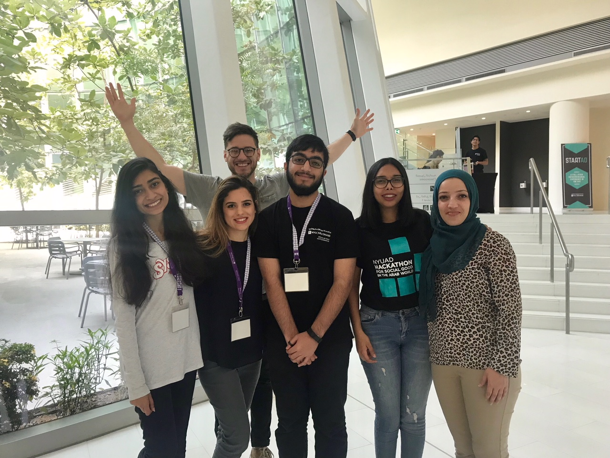

# شوف شاف | ShoofChef

شوف شاف is a mobile app that transforms Arabic menus to gorgeous visualizations to help tourists in their exotic local food selection.
"I am on a see food diet. I see food, I eat it."

## Problem Description

  - Provide a visual aid
  - Encourage tourists to try local food
  - Inform about specific food allergies & diets

## Solution

Mobile app to provide tourists a way to visualize Arabic menus. The main features include:
  - Realtime visual aid of key Arabic dishes
  - Description of ingredients
  - Rating system of dishes
  - Sharing on social media

## Software Components

  - OCR Google Vision API
  - NLP Python NLTK
  - Google Image API
  - Django Python
  - Ionic Mobile App

## Team

  - Rumail Ali Memon • NYUAD • <rm4631@nyu.edu>
  - Rania Fekih • National Institut of Applied Science and Technologie • <raniafekih@hotmail.com>
  - Noor Naqvi • Universitat Politècnica de Catalunya • <noorzehra07@gmail.com>

**Disclaimer:** Team members contributed to various parts of the hack. This breakdown is only a generalization.

### User Interface & iOS App using Ionic

  - Rania Fekih • National Institut of Applied Science and Technologie • <raniafekih@hotmail.com>

### OCR Google Vision API & NLP Python NLTK

  - Noor Naqvi • Universitat Politècnica de Catalunya • <noorzehra07@gmail.com>
  - Rumail Ali Memon • NYUAD • <rm4631@nyu.edu> 

## Mentors

  - Nariman Ammar • BirZeit University • <nammar@birzeit.edu>
  - Sama Kanbour • GE • <k@ge.com>
  - Stephen Lang • Cornell Tech • <steplang@gmail.com>

## Needs for Demo

  - Projector for 1 mobile devices (iPhone)
  - Project laptop for PowerPoint presentation

